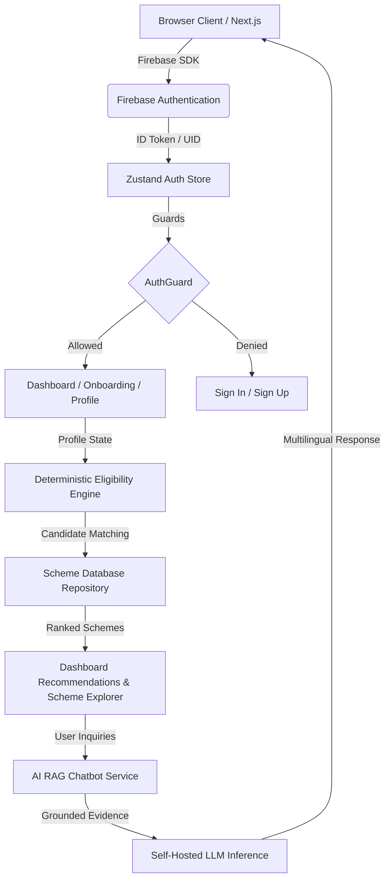

# SYSTEM INTEGRATION & CONNECTION MATRIX

**Document Version**: 1.0.0  
**Scope**: Full-stack connection verification from Client UI down to Database, Storage, and AI/RAG engine.

---

## 1. Connection Matrix Table

| Subsystem Component A | Component B | Connection Mode | Verification Test | Status | Identified Problem & Remediation Required |
| :--- | :--- | :--- | :--- | :--- | :--- |
| **Auth: Google Sign-In** | Firebase Auth Client | `signInWithPopup(auth, googleProvider)` | Client invocation on `/auth/signin` | **CONNECTED** | Client auth succeeds; need server token verification middleware for backend calls. |
| **Auth: Apple Sign-In** | Firebase Auth Client | `signInWithPopup(auth, appleProvider)` | Client invocation on `/auth/signin` | **CONNECTED** | Uses OAuthProvider("apple.com"). Client side verified. |
| **Auth: Email/Password** | Firebase Auth Client | `createUserWithEmailAndPassword` | Form submit on `/auth/signup` | **CONNECTED** | Form validation, password matching, and error alerts verified. |
| **Session Sync** | Zustand Store | `onAuthStateChanged` | Navigation across `/`, `/dashboard` | **CONNECTED** | Reactively updates user state and auth status. |
| **Protected Routes** | `AuthGuard.tsx` | Route redirection via `useRouter` | Unauth visit to `/dashboard` & `/onboarding` | **CONNECTED** | Unauthenticated requests are immediately bounced to `/auth/signin`. |
| **Profile Setup** | `useProfileStore` | LocalStorage + Zustand | 5-step form on `/onboarding` | **PARTIAL** | Persists locally per UID, but lacks persistent cloud database sync (D1/Firestore). |
| **Location Map** | `LocationPicker.tsx` | GPS Navigator + OpenStreetMap coords | Pinpoint on `/onboarding` Step 4 | **CONNECTED** | Resolves lat/lng and standardizes State/District correctly. |
| **Scheme Repository** | Scheme Data Engine | Import/Fetch API | `/schemes` Explorer route | **BROKEN** | Scheme database data and `/schemes` explorer page do not exist yet. |
| **Eligibility Engine** | Profile Matching | Deterministic rule check | Profile evaluate vs Scheme rules | **UNCONNECTED** | Scoring engine exists only for profile completion %, not scheme qualification. |
| **AI Chat & Query** | Self-Hosted AI Service | SSE / Streaming HTTP | `/chat` Assistant route | **UNCONNECTED** | Chat interface and local RAG retrieval pipeline are not yet instantiated. |
| **Saved Schemes** | User Profile Store | Relational Set `user_id <-> scheme_id` | Save button on scheme card | **UNCONNECTED** | UI and data model for user bookmarks/saved schemes not implemented. |
| **Scheme Comparison** | Compare UI Modal | Dual-Scheme Attribute Diff | Scheme comparison view | **UNCONNECTED** | Side-by-side comparison modal/page not yet implemented. |

---

## 2. End-to-End Traceability Blueprint

